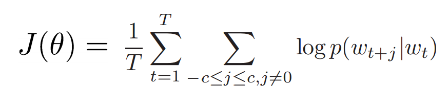

## 计算机怎么表达一个word?
- 利用分类系统如wordnet(NLTK)
	- wordnet按照词义(同义词)和词性的表达单词
	- 问题：
		- 资源多但是没有意义
		- 新的单词
		- 主题
		- 需要人工维护
		- 难以精确计算单词的相似度
	
- one-hot，将单词表达为一个向量
	- 维度 20K(speech) 50K(PTB) 500K(big vocab) 13M(Google 1T)

- 基于分布式相似度的表达
	- 利用单词的邻居表达单词，当代NLP最成功的idea

- 怎样利用邻居表达
	- cooccurence matrix
	- full document (Latent Semantic Analysis)
	- window (5-10)
	- eg. 参看PPT第7页
	- 问题：维度太高、存储空间太多、模型悉数不稳定
	- 解决：使用经常出现的单词，25-1000维
	
- 降维
	- SVD
- 单词被表达为词向量，dense verctor
- hack:
	- ignore the he 等单词
	- Pearson 相似度而不是counts
	
[1]An Improved Model of Seman3c Similarity Based on Lexical CoKOccurrence Rohde et al. 2005 

- 直接学习低维的单词向量
	- Learning representa3ons by backKpropaga3ng errors. 
	(Rumelhart et al., 1986) 
	- A neural probabilis3c language model (Bengio et al., 2003)   
	- NLP from Scratch (Collobert & Weston, 2008) 
	- A recent and even simpler model:  
	 word2vec (Mikolov et al. 2013) ! intro now
	 [2]Glove: Global Vectors for Word Representation

## word2vec
- 预测长度为c的窗口里的每一个单词
- 目标函数：最大化每一个单词在给定的中心单词下的总概率

	 